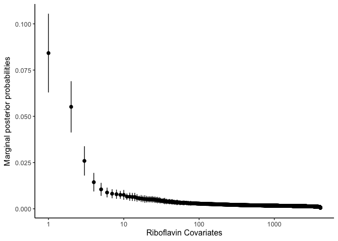

# ScaleSpikeSlab (S^3)

This package contains algorithms for *Scalable Spike-and-Slab* (S^3),
a scalable Gibbs sampling implementation for high-dimensional Bayesian 
regression with the continuous spike-and-slab prior.

It is based on the article "Scalable Spike-and-Slab", 
by Niloy Biswas, Lester Mackey and Xiao-Li Meng. The folder `inst` contains 
scripts to reproduce the results of the article.

## Installation

The package can be installed from R via:


```r
# install.packages("devtools")
devtools::install_github("niloyb/ScaleSpikeSlab/R_package")

# Install dependencies Rcpp, RcppEigen
install.packages(c("Rcpp", "RcppEigen"))
# Install additional packages to help with parallel computation and plotting
install.packages(c("doParallel", "doRNG", "foreach", "dplyr", "tidyr", 
                   "ggplot2", "latex2exp", "reshape2", "ggpubr"))
```

## A tutorial with GWAS data

#### Import data and select hyperparameters. 

```r
set.seed(1)
library(ScaleSpikeSlab)

# Riboflavin linear regression dataset of Buhlmann et al. (2014) 
data(riboflavin)
X <- riboflavin$x
Xt <- t(X)
y <- riboflavin$y

# Choose hyperparamters
params <- spike_slab_params(n=nrow(X),p=ncol(X))
```
#### Run MCMC with S^3


```r
library(doParallel)
registerDoParallel(cores = detectCores()-1)
library(foreach)

no_chains <- 20
sss_chain_z_output <- 
  foreach(i = c(1:no_chains), .combine=rbind)%dopar%{
  sss_chain <- spike_slab_mcmc(chain_length=5e3,burnin=1e3,X=X,Xt=Xt,y=y,
                               tau0=params$tau0,tau1=params$tau1,q=params$q,
                               verbose=TRUE,store=FALSE)
  return(as.vector(sss_chain$z_ergodic_avg))
}
```
#### Plot Spike-and-Slab marginal posterior probabilities for variable selection 


```r
library(dplyr)
library(ggplot2)
library(latex2exp)

riboflavin_df <- 
  data.frame(post_prob_mean=apply(sss_chain_z_output,2,mean),
             post_prob_sd=apply(sss_chain_z_output,2,sd),
             cov_index=c(1:ncol(X)), no_chains=no_chains) %>%
  arrange(desc(post_prob_mean)) %>%
  mutate(xaxis =1:n())


ggplot(riboflavin_df, aes(x=xaxis, y=post_prob_mean)) + 
  geom_point(size=2) + 
  geom_errorbar(aes(ymax=(post_prob_mean+post_prob_sd/sqrt(no_chains)), 
                    ymin=(post_prob_mean-post_prob_sd/sqrt(no_chains))),
                position=position_dodge(.9)) +
  xlab('Riboflavin Covariates') + 
  ylab(TeX('Marginal posterior probabilities')) +
  scale_x_continuous(trans='log10') + theme_classic(base_size = 12)
```

<!-- -->
